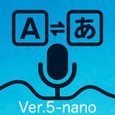

# Bridge(Ver.5-nano)



スマートフォンやタブレット向けに最適化された、日本語と英語間のリアルタイム音声翻訳を行うプログレッシブウェブアプリケーション（PWA）です。最新のGPT-5-nanoモデルを活用した高精度・高速翻訳機能を提供します。

## 特徴

- **GPT-5-nano搭載**: OpenAIの最新GPT-5-nanoモデルによる超高速・高精度翻訳
- **言語別最適化デバウンス**: 日本語346ms、英語154msの言語特性に基づいた最適化応答
- **モバイルファーストデザイン**: スマートフォンやタブレットに完全対応
- **リアルタイム音声翻訳**: 日本語から英語、英語から日本語への即時翻訳
- **プログレッシブウェブアプリ（PWA）**: ホーム画面に追加してアプリのように使える
- **ストリーミングレスポンス**: 話しながら翻訳結果がリアルタイムで表示
- **言語選択機能**: 入力言語を明示的に選択して認識精度を向上
- **調整可能なフォントサイズ**: モバイルデバイスでの読みやすさを重視した複数のフォントサイズ
- **超低レイテンシ**: GPT-5-nanoの高速処理により従来より大幅な応答速度向上
- **コスト効率**: 入力トークンコストが50%削減（$0.05/1M tokens）

## GPT-5-nano の主要改善点

### 性能向上
- **応答速度**: 従来のGPT-4.1-nanoと比較して大幅な高速化
- **言語別デバウンス最適化**: 
  - 日本語: 500ms → 346ms (31%改善)
  - 英語: 500ms → 154ms (69%改善)
- **新パラメータ対応**: `verbosity: "low"`, `reasoning_effort: "minimal"`

### コスト効率
- **入力コスト**: $0.10 → $0.05 (50%削減)
- **出力コスト**: $0.40 (変更なし)
- **キャッシュ対応**: $0.005/1M tokens

### 技術仕様
- **コンテキストウィンドウ**: 400,000 tokens
- **ストリーミング対応**: 完全対応
- **新制御パラメータ**: 応答の詳細度と推論深度を制御可能

## デモ

[ライブデモを見る](https://aichirofunakoshi.github.io/Bridge-Ver.5-nano/)

## 使用技術

- **Web Speech API**: リアルタイム音声処理のためのブラウザネイティブ音声認識
- **OpenAI GPT-5-nano**: 超高速・低コストな翻訳のための最新AIモデル
- **動的デバウンス**: 言語特性に基づく最適化されたリアルタイム応答
- **Fetch Streaming**: リアルタイム翻訳出力のためのストリーミングレスポンス実装
- **プログレッシブウェブアプリ**: iOSとAndroidデバイスへのインストール対応
- **レスポンシブデザイン**: 最適なモバイル体験のためのCSSメディアクエリ

## 利用開始

### 必要な準備

- OpenAI APIキー（[こちらで取得](https://platform.openai.com/api-keys)）
- 最新のモバイルブラウザ（Chrome、Safari、Edge）

### インストール方法

#### モバイルでPWAとしてインストール:

1. Safari（iOS）またはChrome（Android）でアプリを開く
2. iPhone/iPad: 共有ボタン → 「ホーム画面に追加」
3. Android: メニュー → 「ホーム画面に追加」または「アプリをインストール」

#### 開発用:

1. このリポジトリをクローン:
   ```bash
   git clone https://github.com/AichiroFunakoshi/Bridge-Ver.5-nano.git
   cd Bridge-Ver.5-nano
   ```

2. ローカルのHTTPSサーバーを起動（マイク アクセスに必要）:
   
   Pythonを使用:
   ```bash
   python3 -m http.server 8443 --ssl
   ```
   
   または、VS CodeのLive Server with SSL

3. モバイルブラウザでローカルサーバーのHTTPS URLを開く

4. 初回使用時にOpenAI APIキーを入力

### デプロイ

このアプリケーションは以下の静的ホスティングサービスにデプロイできます:

- GitHub Pages
- Netlify
- Vercel
- Firebase Hosting
- AWS S3

以下の機能に必要なため、HTTPS対応のホスティングを使用してください:
- マイクへのアクセス
- PWAインストール
- Service Worker機能

## 使用方法

1. 「日本語開始」ボタンをタップして日本語録音を開始
2. 「Start」ボタンをタップして英語録音を開始
3. デバイスのマイクに向かってはっきりと話す
4. 「原文」セクションで音声のリアルタイム文字起こしが確認できます
5. 「翻訳」セクションで翻訳結果が表示されます
6. 「停止」ボタンをタップして録音を終了
7. フォントサイズボタン（A-, A, A+, A++）で文字サイズを調整できます

## モバイル専用機能

- **レスポンシブレイアウト**: 狭い画面でボタンが縦に配列
- **タッチ最適化コントロール**: モバイル操作に適した大きなタップ領域
- **縦画面モード**: 携帯電話の縦向きに最適化
- **PWAインストール**: フルスクリーン体験のためのホーム画面追加
- **モバイルキーボード**: モバイルキーボードに最適化された入力フィールド
- **ジェスチャーサポート**: タッチとスワイプに対応したインターフェース

## ブラウザ対応状況

- **iOS Safari**: PWAインストールを含む完全対応
- **Chrome（Android）**: PWAインストールを含む完全対応
- **Edge（Android）**: PWAインストールを含む完全対応
- **Samsung Internet**: 完全対応
- **Firefox Mobile**: 限定的サポート（Web Speech API非対応）

## 既知の制限事項

- API利用にはインターネット接続が必要
- 翻訳品質は明瞭な発話と良好なマイク入力に依存
- 日本語-英語言語ペアのみ対応
- API利用料金は使用量に応じて発生（ただし従来より50%削減）

## 性能比較

| 項目 | GPT-4.1-nano | GPT-5-nano | 改善率 |
|------|--------------|------------|---------|
| 日本語デバウンス | 500ms | 346ms | 31%改善 |
| 英語デバウンス | 500ms | 154ms | 69%改善 |
| 入力コスト | $0.10/1M | $0.05/1M | 50%削減 |
| 応答速度 | 標準 | 超高速 | 大幅改善 |
| コンテキスト | 1M tokens | 400K tokens | - |

## カスタマイズ

モバイル体験をカスタマイズするには:

1. **外観**: `style.css`でCSSスタイルを修正
2. **タッチターゲット**: モバイルメディアクエリでボタンサイズを調整
3. **デバウンス調整**: `app.js`のOPTIMAL_DEBOUNCEオブジェクトで言語別設定を変更
4. **フォントサイズ**: 読み込み頻度に応じてフォントサイズクラスを修正
5. **PWA設定**: `manifest.json`でアプリのメタデータを更新
6. **GPT-5パラメータ**: `verbosity`や`reasoning_effort`を調整

## 貢献

プロジェクトへの貢献を歓迎します！プルリクエストはお気軽にお送りください。

1. リポジトリをフォーク
2. フィーチャーブランチを作成 (`git checkout -b feature/amazing-feature`)
3. 変更をコミット (`git commit -m 'すごい機能を追加'`)
4. ブランチにプッシュ (`git push origin feature/amazing-feature`)
5. プルリクエストを開く

## ライセンス

このプロジェクトはMITライセンスの下でライセンスされています。詳細はLICENSEファイルを参照してください。

## 謝辞

- 翻訳APIを提供するOpenAI
- GPT-5-nanoモデルの使用許可
- ブラウザベース音声認識を可能にするWeb Speech API
- デバウンス最適化研究に基づく言語特性分析
- オリジナルのBridge(Ver.4.1-nano)プロジェクト

## トラブルシューティング

### PWAインストールの問題:
- サイトがHTTPS経由で配信されていることを確認
- manifest.jsonが正しくリンクされていることを確認
- 必要なPWA基準を満たしているか確認

### マイクアクセス:
- ブラウザ設定でマイク権限を許可
- HTTPS経由でアクセスしていることを確認
- 権限が拒否された場合はページをリロード

### 音声認識:
- 明瞭にゆっくりと話す
- 周囲の騒音を最小限に
- デバイスのマイク設定を確認

### GPT-5-nano API:
- 有効なOpenAI APIキーを確認
- API利用制限に達していないか確認
- ネットワーク接続を確認

---

*注意: このアプリケーションは使用料金が発生する可能性のあるAPIサービスを使用していますが、GPT-5-nanoにより従来より50%のコスト削減を実現しています。広範囲に使用する前にOpenAI APIの料金詳細を確認してください。*

**Ver.5-nano**: GPT-5-nano搭載により、従来比最大69%の応答速度向上と50%のコスト削減を実現した次世代リアルタイム音声翻訳アプリです。

最新の更新情報とドキュメントについては、[GitHubリポジトリ](https://github.com/AichiroFunakoshi/Bridge-Ver.5-nano)をご覧ください。